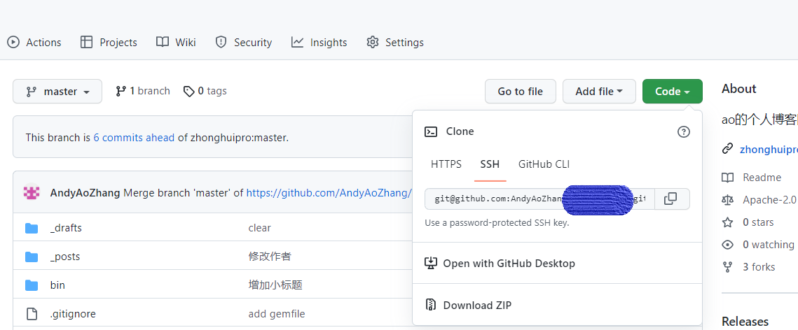

#手把手创建个人博客

步骤1：申请域名，进行实名认证

步骤2：注册GitHub账号

步骤3：安装配置git

步骤4：fork钟老师的个人博客项目‘nvwa’

步骤5：DNS解析域名

步骤6：配置GitHub Pages

步骤7：克隆仓库到本地，修改并上传

步骤8：大功告成！

##步骤1 申请域名，进行实名认证

申请网址：https://wanwang.aliyun.com/

##步骤2 注册GitHub账号

注册网址：https://github.com/

GitHub注册参考：https://zhuanlan.zhihu.com/p/103325381

##步骤3 安装配置git

git下载网址：https://github.com/

git安装参考：https://zhuanlan.zhihu.com/p/103325381

打开Git Bash

a.设置本地的用户名和邮箱地址：

    $git config --global user.name"Your Username"[用户名，建议纯英文] 
    $git config --global user.email"Your email address"[注册GitHub的邮箱地址]

如果想要查询用户名和邮箱地址：

    $git config user.name
    $git config user.email

b.为使本地git可以上传GitHub，需生成密钥：
       
    $ssh-keygen -t rsa
然后敲四次回车键就会生成公钥和私钥，

然后：
   
    $cd ~/ssh
    $cat id_rsa.pub

此时会出现公钥的内容：

复制内容后上传到GitHub生成SSH key

上传步骤如下：
        
    登录GitHub账户后，右上角下拉菜单--Settings--左边栏Access中选‘SSH和GPG keys’--New SSH key--复制确认
##步骤4：fork钟老师的个人博客项目‘nvwa’

nvwa项目网址：https://github.com/zhonghuipro/nvwa

fork之后，在自己的GitHub账号下创建仓库，注意仓库名称用:

    GitHub账户名.github.io

【例如：andyaozhang.github.io】

‘nvwa’是一个个人博客的默认模板，如果大家有完善它的想法，可以给钟老师发pull request

##步骤5：解析域名

按以下循序定位网址并操作：

登录阿里云(https://www.aliyun.com/) -- 控制台--左上角菜单--域名--域名列表--解析--解析设置--添加记录--按照下图所示填写

【其中username是Github的用户名】

GitHub Pages也可以不解析，用apex域连接个人博客， 
但个人倾向于将网站解析成“blog.Username.com”的形式来管理,
这样网站的功能一目了然

##步骤6：配置GitHub Pages

绑定个人域名的流程如下：

    转到GitHub所在博客仓库界面--settings--Pages--Custom domain--输入“blog.Username.com”--Save--待返回“DNS check successful”

'nvwa'项目中，已经有CNAME文件，确认是否与上一步解析的地址一致

##步骤7：克隆仓库到本地，修改并上传

拉取代码之前，先保证电脑安装了IDEA，没有安装的童鞋，参见钟老师“学浪”上的学习资料--Java入门

拉取远程仓库到IDEA的流程：

    复制上图SSH地址–打开IDEA–文件–新建–来自版本控制的项目–将复制的SSH粘贴到URL–点击克隆

网站的内容写在 _posts 文件中，并注意符合Jekyll的命名规则：

    year-month-day-title.md   例如：【2022-08-29-母猪的产后护理.md】

使用Markdown进行文本编辑，不了解Markdown参见菜鸟教程：https://www.runoob.com/markdown/md-tutorial.html

修改完后，上传步骤如下所示：

    点击IDEA左下角的终端--下拉打开Git Bash--

    $git add --all
    $git commit -m"Whatever you want to tag" [“”内填写修改内容]
    $git push

如果提示远程仓库存在本地没有的内容，输入
    $git pull
与远程仓库同步后，再尝试上传

##步骤8：大功告成！

登录 Http://blog.Username.com

##步骤9：show off
找朋友显摆,让他们登录试试看

